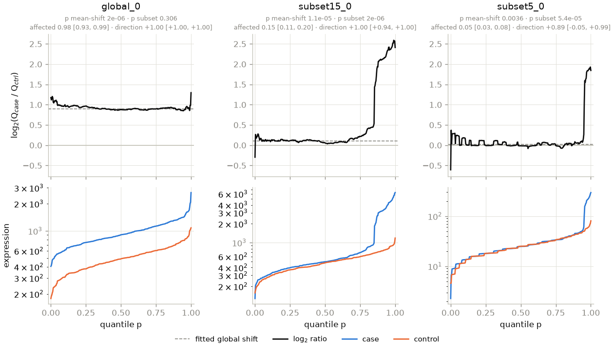
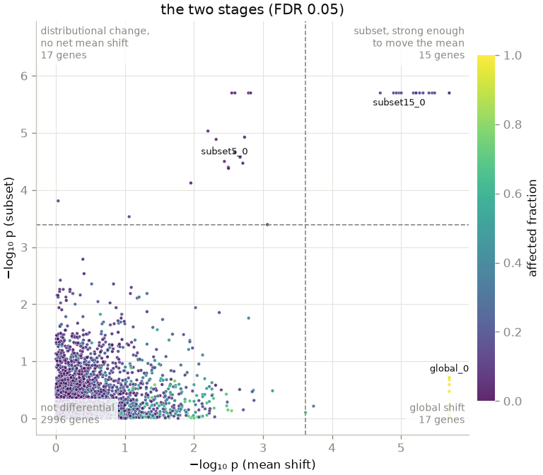

# WADE — Wasserstein Area Differential Expression

A two-group differential-expression test that answers **two** questions instead
of one:

1. **Is there a difference?** — the ordinary question, which any DE method
   answers.
2. **What kind of difference is it?** — a shift affecting every sample, or a
   pronounced change confined to a small subset of one group.

The second question is the point. A gene altered in 5% of cases and a gene
shifted 2× in all of them can produce the same mean difference, and a
first-moment test cannot tell them apart. WADE separates them, and **never asks
you to declare in advance which you are looking for** — there is no percentile
cutoff, no window width, no tuning parameter describing the shape of the effect.

For each gene it compares the two groups' whole quantile functions on a shared
grid of `min(n_case, n_ctrl)` probabilities. Inference is by label permutation,
with a Generalized Pareto fit refining p-values whose empirical resolution has
run out, then BH-FDR.

**Scope: discrete count data.** WADE takes raw counts and is built around what
counts are — the tie-breaking jitter, and a subset stage whose null is built by
binomial thinning of reads ([`docs/method.md`](docs/method.md) §10), neither of
which has a meaning for continuous measurements. `thin=False` and
`thin=False` will run on continuous data and are not tested or tuned for it.

## Install

```bash
mamba env create -f mamba_env.yaml
conda activate wade
pip install -e . --no-build-isolation
pytest                       # ~12 s
pytest -m "not kernel"       # if you built without the Rust toolchain
```

**Building from source needs a Rust toolchain** (`conda install rust`, or
rustup) — the build backend is maturin, so even metadata generation calls
cargo. Once built, the kernels themselves are *optional at run time*: WADE
falls back to the NumPy path, which is the correctness baseline the kernels
are validated against, just slower (about 80× on the subset test). Run
`pytest -m "not kernel"` if you built without them. Wheels (one per platform,
abi3 so a single wheel covers Python 3.10+) are built in CI; when they are
published, `pip install wade` will need no toolchain at all.

Plotting is optional too: `pip install 'wade[plot]'` (or `conda install plotly
matplotlib-base`) adds both backends; either one alone is enough. `wade[io]`
adds polars for writing results. Nothing in the statistic imports any of them.

## Use it

```python
import numpy as np
from wade import wade

# counts: genes x samples, RAW counts (see "Why raw counts" below)
# normalizer: a per-gene vector (e.g. gene length) or a genes x samples matrix
# cond: 1 = case, 0 = control, one entry per column
res = wade(counts, normalizer, cond, nperms=2000)
```

### Reading the result

| column | question it answers |
|---|---|
| `mean_shift` | how much did average expression move? (signed) |
| `p_mean_shift`, `padj_mean_shift` | is that shift significant? |
| `p_subset`, `padj_subset` | is a global shift an **inadequate** explanation? |
| `affected_fraction` | what fraction of samples differ? `1.0` = all of them |
| `subset_log2_fc` | by how many folds does that fraction differ? (quantile-matched) |
| `direction` | `+1` all up, `-1` all down, `0` two-sided |
| `z_mean_shift`, `z_subset` | how far past its own permutation null? — the ranking that keeps working when p-values hit the resolution floor (GSEA's NES, in z form) |
| `log2_fc`, `w1` | fold change; 1-Wasserstein distance |

**Batch-structured cohorts.** If your samples come from several studies,
batches or protocols, pass `strata=` (per-sample labels) and the permutation
null shuffles labels only *within* each stratum, holding that structure fixed
rather than testing it as biology. `wade.permutation_space()` reports the
permutation freedom that leaves you, because stratifying costs resolution —
see [`docs/limits.md`](docs/limits.md) §2.1.

On a large cohort the p-values saturate — thousands of genes tie at the
resolution floor — so the working recipe is: **filter** by `padj_*`, then
**rank** by magnitude (`subset_log2_fc`, `log2_fc`) or by `z_*`.

With `n_boot=300` the three descriptive statistics also carry bootstrap 95%
intervals (`ci_affected_fraction`, `ci_direction`, `ci_log2_fc`, and `*_lo` /
`*_hi` columns).

Four patterns, read off the two p-values and the two descriptors:

| `p_mean_shift` | `p_subset` | what you are looking at |
|---|---|---|
| significant | — | a **global shift**; an ordinary DE method finds this too |
| significant | significant | a **subset**, strong enough to move the mean. `affected_fraction` says how much of the group, `direction` says which way |
| — | significant | a distributional change with **no net mean shift**: a balanced subset, or a variance change |
| — | — | not differential |

There is deliberately no categorical label and no `interpret()` function.
Turning continuous statistics into classes needs thresholds, which is what this
design exists to avoid.

```python
res.columns()          # dict of equal-length arrays
res.report()           # the same table in the written column order
res.to_frame()         # ... as a polars DataFrame
```

### Getting data in, and results out

**WADE reads no files.** polars and pandas already read CSV, TSV, Parquet,
Arrow, Excel and gzip better than this package would, so WADE *accepts* what
your reader produced and concentrates on the part that is actually its job:
interpreting the matrix unambiguously, aligning your sample sheet by name, and
writing results.

```python
import polars as pl, wade

counts  = pl.read_csv("counts.tsv", separator="\t")   # gene id + one column per sample
samples = pl.read_excel("samples.xlsx")               # sample_id, condition, ...

cond = wade.condition(samples, key="sample_id", column="condition",
                      case="tumor", control="normal")

res = wade.wade(counts, "Length", cond, nperms=2000, n_boot=300)
wade.write_results(res, "results.tsv")                # + results.manifest.json
```

`counts` may be a NumPy array, a polars or pandas DataFrame, a sparse matrix,
or a `wade.Counts` from `wade.as_counts()` — which is also where you say
`genes="columns"` for a transposed matrix, or `sample_columns=[...]` for a
frame with annotation columns in the middle (a featureCounts file). Gene and
sample labels are **optional**; without them WADE numbers them positionally.
`normalizer` may be a vector, a matrix, a scalar, or the **name of a column**
carried alongside the counts.

The alignment is strict on purpose. A sample in the matrix with no metadata
row, a metadata row matching no sample, a duplicate id, or a third level in the
condition column all raise and name the offenders — a silently dropped sample
is a silently different analysis, and because library sizes are computed on the
samples handed in, a silently different normalization too.

`wade_contrast()` takes sample **names** for its two groups (or integer
positions, if that is what you have).

### Worked example

```python
import numpy as np
from wade import wade

rng = np.random.default_rng(0)
n1 = n0 = 200
cond = np.r_[np.ones(n1, int), np.zeros(n0, int)]

genes = []
genes += [np.r_[rng.lognormal(3, .6, n1), rng.lognormal(3, .6, n0)]        # null
          for _ in range(300)]
genes += [np.r_[rng.lognormal(3, .6, n1) * 2, rng.lognormal(3, .6, n0)]    # global 2x
          for _ in range(20)]
for _ in range(20):                                                         # 5% subset
    case = rng.lognormal(3, .6, n1)
    case[rng.choice(n1, 10, replace=False)] *= 8
    genes.append(np.r_[case, rng.lognormal(3, .6, n0)])

counts = np.array(genes)
res = wade(counts, np.full(counts.shape[0], 4.0), cond, nperms=500)

for name, sl in (("null", slice(0, 300)), ("global", slice(300, 320)),
                 ("subset", slice(320, 340))):
    print(f"{name:<8s} p_mean={np.median(res.p_mean_shift[sl]):.3f}  "
          f"p_subset={np.median(res.p_subset[sl]):.3f}  "
          f"affected={np.median(res.affected_fraction[sl]):.2f}")
```

The planted 5% subset shows the point: the mean-shift test largely misses it
while the subset test finds it, and `affected_fraction` recovers roughly 0.05.
A genuine global shift is the mirror image — found by the mean test, and
correctly **not** flagged as a subset.

### Seeing it

Three figures, each answering one question. They are a **convenience layer**,
deliberately kept at arm's length from the statistic — `import wade` imports no
plotting library, neither backend is a dependency, and every number a figure
draws is already in `res.report()`. Exporting the table and plotting in ggplot
loses you nothing. [`docs/plotting.md`](docs/plotting.md) is the full story.

```python
from wade import plot_gene, plot_volcano, plot_stages

plot_gene(res, gene=[300, 320])             # what does this gene's difference look like?
plot_volcano(res, stage="both", label=5)    # which genes?
plot_stages(res)                            # what kind of difference?

# Either axis takes any result column. On a large cohort, where the p-values
# saturate, this is the view that still separates genes:
plot_volcano(res, stage="subset", x="subset_log2_fc", y="z_subset", label=8)
```

**`plot_gene`** is the figure that makes the method legible. The top row is the
log-ratio curve `R(p) = log2 Q_case(p) − log2 Q_ctrl(p)`; the bottom row is the
two quantile functions it is the ratio of. A **flat** curve is a global fold
change; a curve that sits at zero and then **climbs** is a subset. The dashed
line is `log2` of the **fitted** global fold change — the shift the subset test
takes as its null — so the curve's departure from it is what `p_subset` prices.



The first two genes have the **same log₂ fold change** (+0.92 and +0.94). The
mean-shift test cannot tell them apart; the curve, `p_subset` and
`affected_fraction` (0.98 against 0.15) can.



### Choosing direction

```python
wade(..., alternative="two-sided")   # default: differences either way
wade(..., alternative="greater")     # only elevation in cases
wade(..., alternative="less")        # only reduction in cases
```

### Why raw counts

The entry point takes **raw counts**, not a normalized matrix. WADE adds a tiny
continuity jitter at *count precision* before dividing, which breaks ties in
zero-heavy data where many samples share a count of zero and the quantile grid
would otherwise degenerate into flat runs. Once counts have been divided by a
normalizer and a library size that perturbation cannot be reconstructed.

**There is no entry point for an already-normalized matrix**, and that is a
decision rather than a gap. Such a matrix loses the tie-breaking above *and*
the subset stage's null, which is built by binomial thinning of reads — with no
counts to thin it falls back to a division that we measured firing on 95% of
genuine global 2× shifts at 2 counts (`docs/method.md` §10.2). Stage 1 alone
would still be valid, but a stage-1-only WADE is a mean-difference permutation
test, which is not what this package is for. If you only have TPM, go back to
the counts.

Normalization is `tpm_like` — counts over a per-gene normalizer over a library
size — and it is the one the jitter is built into, which is why `wade()` takes
raw counts. It covers the alternatives through its own arguments rather than
through extra functions: **CPM** is `normalizer=1.0` (identical to a dedicated
CPM up to the per-cell denominator of §8), and for **RLE** or any other size
factors, compute them and pass `lib_sizes=`.

## Before you run it: two things to check

Both are arithmetic on your **design**, not properties of the software, and
neither is fixable with more data or more permutations.

**Resolution.** The grid has `min(n_case, n_ctrl, max_probs)` points, so
nothing finer than `1/m` is estimable. `affected_fraction` is quantitative
above roughly 100 per group and only qualitative below about 50. At the other
end, `max_probs` (default 2,000) caps the grid on very large cohorts so that
per-gene memory stops growing with the design; keep it at or above
`2.5 / (smallest fraction of interest)` — the default resolves a 0.1% subset
— and the realized `m` is `result.nprobs` and in the manifest
([`docs/method.md`](docs/method.md) §1).

**The combinatorial floor.** If `k` samples carry a signal, shuffling puts all
of them in one group with probability `C(n1,k)/C(n1+n0,k)` — and **no
permutation test can return a p-value below that.** At 77 cases vs 18 controls
the floor is still 0.032 with 15 affected samples. It is driven by group
*imbalance*: balancing the groups helps far more than adding cases.

[`docs/limits.md`](docs/limits.md) has both in full, plus the checklist of when
to reach for something else.

**And one thing to know about low-expression genes.** Below about five counts
per sample the log scale is noise-dominated — one count is one log unit — so
`affected_fraction` is qualitative there (a global 2× reads ≈0.70 rather than
1.0). The *test* is unaffected: the subset stage's null is built by binomial
thinning of the counts, which is exact at every expression level
([`docs/method.md`](docs/method.md) §10). Run with `n_boot=300` and read the
interval, which is wide exactly where the estimate is soft.

## Documentation

- [`docs/method.md`](docs/method.md) — what WADE computes and why. The contract.
- [`docs/limits.md`](docs/limits.md) — what it cannot do; read before running.
- [`docs/scaling.md`](docs/scaling.md) — large cohorts: every measurement, and
  what is still open.
- [`docs/plotting.md`](docs/plotting.md) — the plotting **extension**: the data
  layer, how to plot elsewhere, and what this layer is not for.
- [`docs/implementation-notes.md`](docs/implementation-notes.md) — parity with
  the R original, the cross-language traps, the Rust kernel's boundary.
- [`ROADMAP.md`](ROADMAP.md) — the work queue.

## Status

Implemented and tested: the statistic, both stages, the characterization, the
normalizers, permutation inference with GPD refinement and BH, Rust kernels
for both permutation loops, the count-native subset stage (binomial thinning,
the one-count pseudocount, bootstrap intervals), the plotting layer, and the
data-in/results-out boundary. **694 tests, about 10 s.**

At 20,000 genes, 100 v 100 and 2,000 permutations a full run takes about 17 s
on a 16-core laptop (9.7 s with `thin=False`); the permutation loops, which
were 98% of the runtime on NumPy — about 5 minutes — now take 8 s and are held
bitwise to the NumPy path.

Large cohorts are first-class (`docs/scaling.md`): the quantile grid is
capped (`max_probs`), genes can be processed in blocks whose results are
bit-identical to the one-pass run (`gene_chunk`), and two opt-in fast paths —
`stage1="gemm"` on balanced designs and `fit_backend="rust"` for the
fold-change fit — bring a 1,000-gene, 6,000 v 6,000, 200-permutation run from
20 s to 2.3 s. A 30,000-gene × 80,000-sample cohort, which previously needed
~163 GB and did not run, completes in **30 minutes at a 56 GB peak** with
2,000 permutations (measured; `docs/scaling.md` §1).

Ported from an R implementation that remains in `reference/` as the oracle the
golden fixtures were generated from. Worst-case relative deviation across 325
parity comparisons: **9.2e-15**, with the normalized matrix, the quantile grids
and the permutation null bit-for-bit identical.

Not yet built: the demo notebook, and format-specific reader helpers for
featureCounts and MatrixMarket. See the roadmap.

## Provenance

Extracted from the MCTP cfRNA analysis repository at commit `828f2f1c`, where it
began as a small set of functions called HITLIB. No patient-derived data is
included; everything here is synthetic. Details in
[`reference/PROVENANCE.md`](reference/PROVENANCE.md).

## License

GPL-3. See [`LICENSE`](LICENSE).
